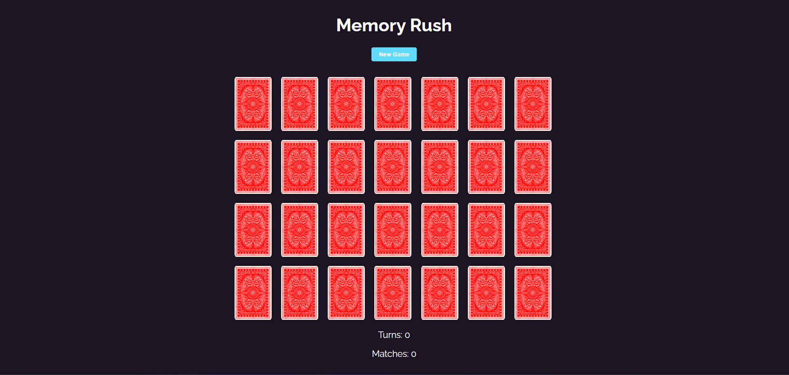

# 🎮 Memory Rush Game 🧠

Memory Rush is a card-matching memory game. The objective is to match all the pairs of cards in as few turns as possible. When you find all the pairs, you win! 🎉

## How to Play
1. Click on **New Game** to shuffle the cards and start a new game. 🎲
2. Click on two cards to reveal them. If the cards match, they will remain flipped. If they don't match, they will flip back over after a short delay. 🔄
3. Keep selecting pairs of cards until all matches are found. 🃏🃏
4. Once you match all the cards, a **"You Won!"** message will appear. 🏆

## Game Features ✨
- **Shuffling**: The game shuffles cards at the beginning of each new game. 🔄
- **Match detection**: Matched cards will remain flipped. ✅
- **Turn counter**: Keep track of how many turns it takes to match all the cards. 📊
- **Win condition**: When all matches are found, a **"You Won!"** message will be displayed. 🎉

## Preview 👀

### Start a New Game
  

### During the Game
  

## Technologies Used 💻
- **React**: The game is built using React for managing state and rendering components.
- **CSS**: The game is styled with CSS to make it visually appealing and provide smooth transitions.

## Instructions to Run the Game 🛠️
1. Clone this repository:
    ```bash
    git clone https://github.com/your-username/memory-rush.git
    ```
2. Navigate into the project folder:
    ```bash
    cd memory-rush
    ```
3. Install the dependencies:
    ```bash
    npm install
    ```
4. Start the application:
    ```bash
    npm start
    ```
5. Open [http://localhost:3000](http://localhost:3000) to view the game in your browser.

## Note 📜
This project was made with a huge credit for "Ninga Net" that guided me on this project.
